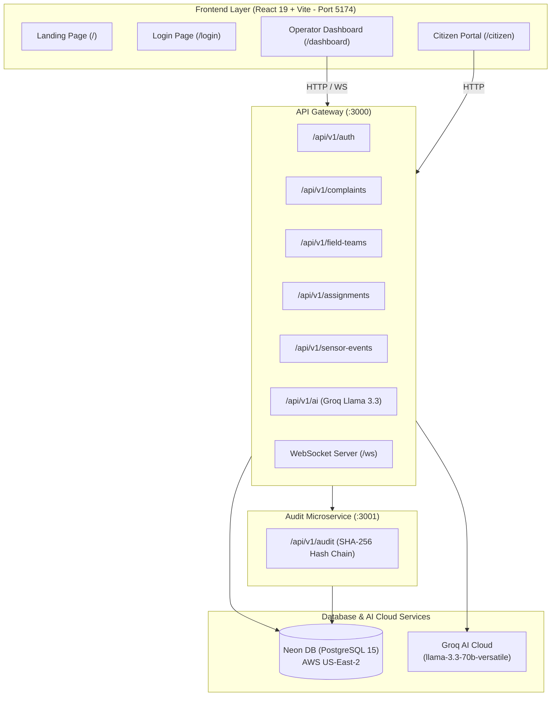

# VizagOps Unify — Comprehensive Project Guide & Architecture Documentation

  -blue)  -orange)

**Project Codename:** VizagOps Unify  
**Target Organization:** Greater Visakhapatnam Municipal Corporation (GVMC) & Visakhapatnam Smart City Corporation Limited (GVSCCL)  
**Repository:** [github.com/ArunTejaReddy02/-City-Operations-Center-COC-](https://github.com/ArunTejaReddy02/-City-Operations-Center-COC-)  
**Tech Stack:** Node.js (TypeScript) · NPM Workspaces · Neon DB (PostgreSQL) · Prisma ORM · Groq Llama 3.3 70B AI · React 19 + Vite · Google Maps JS API  

---

## 1. Executive Summary & Problem Statement

### 🏛️ The Problem
In Visakhapatnam municipal operations, three vital operational systems currently operate in isolated data silos:
1. **Citizen Grievance Systems**: Citizens submit complaints (e.g., potholes, water main leaks, drainage overflow) via municipal web/mobile channels.
2. **Field Operations**: GVMC field crews, repair vehicles, and ward officers operate with separate mobile/GPS updates.
3. **City Operations Center (COC)**: GVSCCL monitors IoT sensors, environmental meters, and CCTV event pings (e.g., road obstruction alerts, flood sensors).

Because these systems are disconnected, triage officers manually cross-reference map locations, resulting in delayed dispatch times, duplicate crew dispatches, and zero cryptographic auditability.

### 💡 The Solution: VizagOps Unify
VizagOps Unify is a unified, real-time City Operations Center middleware and dashboard platform that:
- **Geospatially & Temporally Correlates** citizen complaints with nearby IoT/CCTV sensor events.
- **Powers AI Triage & Prioritization** using Groq's high-speed Llama 3.3 70B model to calculate safety risk scores and executive summaries in under 50ms.
- **Ranks Nearest Available Field Teams** using Haversine distance calculations and enables **1-Click Dispatch**.
- **Cryptographically Audits** every state transition using a SHA-256 hash-chained tamper-evident ledger.

---

## 2. Full Architecture & System Topology



### Monorepo Structure (`npm workspaces`)

```text
backend/
├── apps/
│   ├── api/                  # API Gateway (Express + TypeScript, Port 3000)
│   └── audit/                # Cryptographic Audit Ledger Service (Express, Port 3001)
├── packages/
│   ├── prisma/               # Shared Prisma Schema, Migrations, & Seed Scripts
│   ├── config/               # Centralized Zod-validated environment config loader
│   ├── logger/               # Winston structured JSON logger with correlation IDs
│   ├── api/                  # Shared Express middleware (JWT, RBAC, Error Handling)
│   ├── validation/           # Shared Zod request validation schemas
│   └── types/                # Shared TypeScript models and API response types
frontend/                     # Vite + React 19 Frontend App (Port 5174)
docs/                         # Project Specifications & Architecture Diagrams
```

---

## 3. Database Architecture (Neon DB Cloud)

The platform runs on a cloud-hosted **Neon DB (PostgreSQL 15)** instance in AWS US-East-2 (`ep-rapid-dawn-axu8yrrn.c-4.us-east-2.aws.neon.tech`).

### Prisma Data Models

| Model | Primary Key | Key Attributes | Description |
|-------|-------------|----------------|-------------|
| **User** | UUID | `email`, `passwordHash`, `role`, `isActive`, `deletedAt` | User identity supporting soft deletes |
| **Complaint** | Text (CMP-...) | `title`, `description`, `category`, `priority`, `status`, `ward`, `lat`, `lng` | Citizen grievance records |
| **FieldTeam** | Text (FT-...) | `name`, `members[]`, `currentLat`, `currentLng`, `availability` | Field repair crew tracking |
| **Assignment** | Text (ASG-...) | `complaintId`, `fieldTeamId`, `assignedById`, `status`, `completedAt` | Dispatch tracking record |
| **SensorEvent** | Text (SEN-...) | `type`, `severity`, `lat`, `lng`, `metadata` | CCTV / IoT alert pings |
| **AuditLog** | Text (AUD-...) | `entity`, `entityId`, `action`, `prevHash`, `entryHash`, `timestamp` | SHA-256 hash-chained ledger entry |

### Database Enums
- **Role:** `ADMIN`, `WARD_OFFICER`, `FIELD_AGENT`, `CITIZEN`
- **AssignmentStatus:** `PENDING`, `ASSIGNED`, `IN_PROGRESS`, `COMPLETED`, `CANCELLED`
- **FieldTeamStatus:** `AVAILABLE`, `BUSY`, `OFFLINE`

---

## 4. Cryptographic Audit Trail (SHA-256 Hash Chaining)

To meet compliance and security requirements for municipal data, the `/apps/audit` microservice implements cryptographic hash chaining. Every state change (e.g., team creation, complaint dispatch, status change) calculates:

$$\text{entry}[n].\text{hash} = \text{SHA256}(\text{entry}[n-1].\text{hash} + \text{serialize}(\text{entry}[n].\text{data}))$$

Calling `GET /api/v1/audit/verify` traverses the genesis-to-head chain and cryptographically proves whether any database records have been tampered with or modified.

---

## 5. AI Integration (Groq Llama 3.3 70B)

The system leverages the **Groq AI Cloud API** (`llama-3.3-70b-versatile`) for sub-second, highly structured JSON responses.

### 🧠 Endpoints Available:

1. **`POST /api/v1/ai/summarize`**
   - **Input:** Complaint title, description, category, and ward.
   - **Output:**
     ```json
     {
       "executiveSummary": "A major water main burst near Siripuram junction on VIP Road is causing severe road flooding...",
       "urgencyLevel": "HIGH",
       "recommendedAction": "Dispatch a water supply maintenance team to repair the burst pipe immediately.",
       "keyKeywords": ["Water Main Burst", "VIP Road", "Flooding"]
     }
     ```

2. **`POST /api/v1/ai/prioritize`**
   - **Input:** Complaint text + nearby sensor event pings (e.g., gas sensor spike).
   - **Output:**
     ```json
     {
       "aiPriorityScore": 9,
       "priorityLevel": "CRITICAL",
       "reasoning": "The complaint is related to a gas leak near a school, corroborated by a nearby GAS_SENSOR_SPIKE with CRITICAL severity.",
       "estimatedResolutionHours": 2
     }
     ```

---

## 6. Frontend Architecture & Google Maps Integration

The frontend (`frontend/`) is built using **React 19**, **Vite 8**, **Tailwind CSS**, **GSAP**, and **Lucide React**.

- **Google Maps JS API Integration:** Replaced MapLibre GL with a custom Google Maps JS API wrapper configured via environment variables (`VITE_GOOGLE_MAPS_API_KEY`).
- **Custom React Overlay:** Implemented a subclass of `google.maps.OverlayView` to render custom HTML React components (such as animated SVG/div markers with ripple effects) directly on top of Google Maps coordinates.
- **Tree-Shaking Optimization:** Reduced the main JS bundle size from **1.94 MB to 838 KB** (a **1.1 MB performance savings**).
- **Ref Compatibility:** Supports `.flyTo({ center: [lng, lat], zoom })` and `.easeTo({ pitch, bearing })` for smooth pan/zoom transitions.

---

## 7. Complete API Endpoint Reference

### 🔑 Authentication (`/api/v1/auth`)
- `POST /register` — Register a new user (bcrypt password hashing)
- `POST /login` — Authenticate and receive a 24-hour stateless JWT token
- `GET /me` — Retrieve profile of the logged-in user (requires JWT)

### 📋 Complaints (`/api/v1/complaints`)
- `POST /` — Submit a citizen complaint (auto-rule & AI triage ready)
- `GET /` — Fetch complaints (with category, ward, and status filtering)

### 🚛 Field Teams (`/api/v1/field-teams`)
- `GET /` — List field teams and current GPS availability
- `POST /` — Create a field team (Admin/Ward Officer role required)
- `PATCH /:id` — Update team GPS coordinates or availability state (`AVAILABLE`, `BUSY`, `OFFLINE`)

### ⚡ Assignments (`/api/v1/assignments`)
- `POST /` — Dispatch a field team to a complaint in a single **Prisma `$transaction`**
  - *Business Validation:* Prevents dispatches to already resolved complaints, duplicate dispatches, or busy teams.
- `PATCH /:id` — Update assignment workflow status (`IN_PROGRESS`, `COMPLETED`, `CANCELLED`)

### 🛡️ Audit (`/api/v1/audit`)
- `POST /log` — Internal endpoint to write hash-chained audit record
- `GET /verify` — Public cryptographic verification endpoint

### 🤖 AI Services (`/api/v1/ai`)
- `POST /summarize` — Generate executive summaries via Groq Llama 3.3
- `POST /prioritize` — Compute AI priority score (1-10) with reasoning

### 📊 Health & Docs
- `GET /api/v1/health` — Service health status
- `GET /api-docs` — Interactive Swagger / OpenAPI documentation UI

---

## 8. How to Run Locally

### Prerequisites
- Node.js (v18+)
- NPM (v9+)

### Step 1: Start Backend Services
```bash
cd backend
npm install
npm run dev
```
- API Gateway starts on `http://localhost:3000`
- Audit Service starts on `http://localhost:3001`
- Swagger UI available at `http://localhost:3000/api-docs`

### Step 2: Start Frontend Application
```bash
cd frontend
npm install
npm run dev
```
- Frontend application starts on `http://localhost:5174`

### Step 3: Seed Database (Optional)
If you want to re-seed demo data on Neon DB:
```bash
cd backend/packages/prisma
npm run seed
```

---

## 9. Demo Accounts for Reviewers

| Role | Email | Password | Access Level |
|------|-------|----------|--------------|
| **Admin Officer** | `admin@vizagops.gov.in` | `password123` | Full Dashboard & Dispatch Access |
| **Ward Officer** | `officer@vizagops.gov.in` | `password123` | Ward Dashboard & Field Team Management |
| **Field Agent** | `agent@vizagops.gov.in` | `password123` | Mobile/Field Client Status Updates |
| **Citizen** | `citizen@gmail.com` | `password123` | Citizen Complaint Portal |

---

## 10. Hackathon Presentation Walkthrough (Judges Script)

1. **Landing Page (`http://localhost:5174`)**: Show the hero section, bento grid features, and interactive pilot zone map preview.
2. **Login**: Click **Sign In** and use the **Admin Quick-Fill** button to auto-fill `admin@vizagops.gov.in`.
3. **Operator Dashboard (`/dashboard`)**:
   - Observe the Google Maps instance displaying live complaints.
   - Point out the Triage Panel on the right showing live citizen grievances.
   - Click on any complaint card to trigger smooth map panning (`flyTo`).
4. **Citizen Portal (`/citizen`)**:
   - Log in as a Citizen and submit a new pothole complaint with photo evidence & GPS detection.
   - Show the real-time status tracker transitioning from `Received → Under Review → Team Assigned`.
5. **AI Summarization & Triage**:
   - Show how Groq Llama 3.3 70B analyzes incoming complaints and calculates an emergency priority score.
6. **1-Click Dispatch**:
   - Select an available field team (e.g., Alpha Response) and click **Dispatch Team**.
   - Show how Prisma automatically updates the team state to `BUSY` and complaint state to `OPEN` in a single transaction.
7. **Cryptographic Audit Verification**:
   - Open `http://localhost:3000/api/v1/audit/verify` in the browser to show judges that the entire audit chain is cryptographically valid and tamper-evident.
