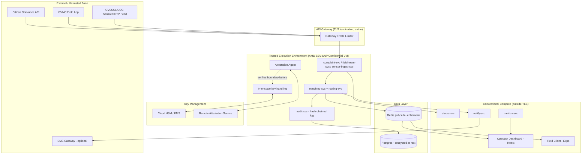
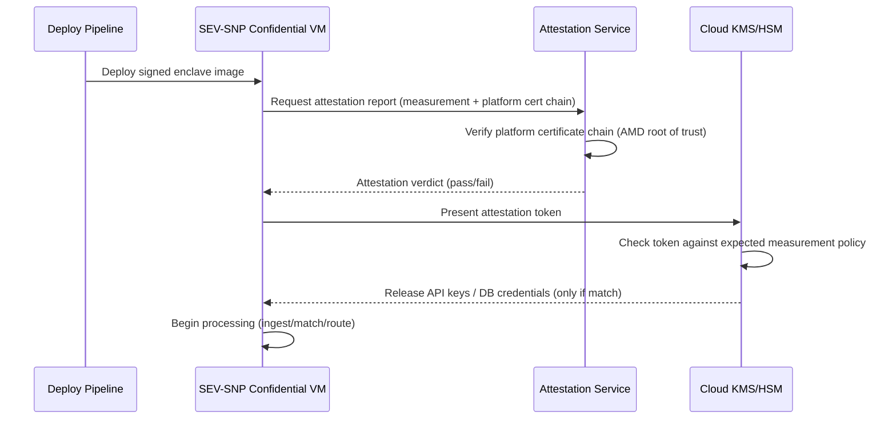

# Technical Architecture Plan (TAP)
## VizagOps Unify — GVMC/GVSCCL Unified Civic Operations Pilot
**Version:** 1.0 | **Based on PRD v1.0** | **Classification:** Government Pilot — Handle as Sensitive

---

## 1. Executive Summary

VizagOps Unify correlates GVMC citizen complaints, GVMC field-team status feeds, and GVSCCL City Operations Center (COC) sensor/CCTV event metadata to auto-suggest and dispatch the nearest available field team. Because the system touches government citizen-grievance data and COC sensor feeds, this TAP treats it as a government-grade deployment and adds a Trusted Execution Environment (TEE) layer around the matching/routing engine and the key-management path, even though the source PRD scoped a lightweight 3-week hackathon build.

**Recommended TEE platform:** **AMD SEV-SNP** (confidential VMs), with **Intel SGX** enclaves as an optional hardening layer for the matching-engine microservice specifically. Rationale in §4.1.

**Major risk called out up front:** the PRD's budget (₹8,000–15,000/month, small VM tier) and 3-week timeline are not compatible with standing up genuine TEE infrastructure, remote attestation, and an HSM-backed KMS. Confidential-VM offerings (SEV-SNP) on major clouds start in the ₹15,000–40,000/month range even at small instance sizes, before KMS/attestation service costs. **This is flagged as an open question requiring PM/Commissioner's Office sign-off in §14** — either the budget needs revision, the TEE scope needs to be narrowed to a single high-value service (recommended: the matching engine + key material only), or TEE adoption is deferred to a post-pilot production phase while the pilot itself ships with strong-but-conventional security (mTLS, per-source API keys, encryption at rest, least-privilege IAM) as a stepping stone.

**High-level acceptance criteria:** (1) all functional ACs from PRD §5/§6 pass; (2) citizen PII never leaves the enclave boundary unencrypted; (3) remote attestation succeeds before any enclave receives live API keys; (4) latency budget (<5s ingestion-to-dashboard, PRD §9) is met with TEE overhead included; (5) GVMC IT can independently verify attestation state post-handover.

---

## 2. Mapping from PRD to TAP

| PRD Feature (§6 ref) | Backend Component(s) | TEE-Related Implications | Acceptance Test |
|---|---|---|---|
| Complaint ingestion API (#1) | `complaint-svc` (Node.js) behind API gateway | Citizen ID (even anonymized) validated/normalized inside enclave before persistence | POST returns ID <200ms; payload never logged outside enclave boundary |
| Field-team status/location feed (#2) | `field-team-svc` | Location data processed in enclave if treated as sensitive (officer safety data) | Map updates <3s; location never written to plaintext logs |
| COC sensor/CCTV event ingestion (#3) | `sensor-ingest-svc` | Highest sensitivity — GVSCCL feed credentials and raw event stream live only inside enclave | Event stored + queryable; ingest credentials never resident outside TEE memory |
| Matching engine (#4) | `matching-svc` — **primary TEE candidate** | Correlation logic + both data streams co-resident; this is the one place complaint + sensor data intersect, so it's the highest-value enclave boundary | 90% precision on 20-pair test set; attested enclave measurement matches expected hash before processing begins |
| Nearest-team routing (#5) | `routing-svc` | Runs inside same enclave boundary as matching engine to avoid a plaintext hop | Top-3 ranked list with ETA; no location data crosses enclave boundary unencrypted |
| Operator dashboard (#6) | `dashboard-web` (React) — **outside TEE** (UI can't run in enclave) | Dashboard receives only decrypted-for-display data over authenticated TLS from the enclave's sealed output | Live WebSocket updates; session auth enforced |
| One-click assignment/notification (#7) | `notify-svc` | Assignment payload signed by enclave before leaving trust boundary | Push <5s; signature verified at field client |
| Field client (#8) | `field-client` (Expo/React) | Same trust boundary as dashboard — outside TEE | Assignment view + status toggle functional |
| Citizen status endpoint (#9) | `status-svc` | Low sensitivity (status string only) — can run outside TEE | Correct status string returned |
| Audit log (#10) | `audit-svc` | Log entries hashed/chained inside enclave before write, so GVMC IT can detect tampering | Every state transition logged with actor/timestamp; hash chain verifiable |
| Instrumentation (#11) | `metrics-svc` | Aggregated metrics only — no raw PII leaves enclave | Latency/match-rate dashboard populated |
| SMS/push (#12, stretch) | `sms-gateway-adapter` | Third-party gateway is **outside** the trust boundary — treat as untrusted; only minimal payload (assignment ID, not full complaint) crosses | Notification delivered on assignment |

---

## 3. Architecture Overview



**Deployment topology:** Single-region (India cloud region, e.g. Mumbai/Hyderabad for data-residency alignment with GVMC/state requirements) for the pilot; single confidential-VM host running the enclave workloads; conventional container hosts (K8s namespace or plain VMs) for dashboard/field-client/status services; managed Postgres with encryption-at-rest and managed Redis. No multi-region redundancy in pilot scope — noted as a gap for production.

---

## 4. TEE Design and Integration

### 4.1 TEE Platform Selection

| Option | Security Properties | Deployment Feasibility (3-wk pilot) | Cost | Verdict |
|---|---|---|---|---|
| **AMD SEV-SNP (confidential VM)** | Full-VM memory encryption + integrity, remote attestation, runs unmodified Linux/Node.js | High — available as a VM SKU on major clouds, no code rewrite | Moderate-high | **Recommended** — least engineering lift for a Node.js stack |
| **Intel SGX** | Fine-grained enclave (app-level, not full-VM), strongest isolation for the specific matching-engine logic | Low-moderate — requires enclave SDK (Gramine/Occlum) to run Node.js in-enclave; real engineering lift | Moderate | Optional hardening for `matching-svc` only, post-pilot |
| **ARM TrustZone** | Good for edge/mobile trust, not a natural fit for cloud API backend | Low — not applicable to this workload | N/A | Not recommended |
| **Open-source TEE (Keystone, etc.)** | Flexible, RISC-V focused, immature tooling | Very low for a 3-week timeline | Low hardware availability | Not recommended for pilot |

**Recommendation:** Ship the pilot on **AMD SEV-SNP confidential VMs** for the ingest + matching + audit services (the "TEE" box in §3). Treat SGX enclaving of the matching engine specifically as a **Phase 2 (post-pilot production hardening)** item — it requires porting the matching logic to run under an SGX runtime, which is not realistic inside the 3-week hackathon window without adding dedicated security-engineering time (see §13).

### 4.2 Enclave Boundaries

**Inside the TEE:**
- `complaint-svc`, `field-team-svc`, `sensor-ingest-svc` — anything that touches raw citizen or COC data before it's matched
- `matching-svc` / `routing-svc` — the only place complaint data and sensor data are correlated together
- `audit-svc` write path and hash-chaining
- In-memory handling of API keys/tokens for GVMC and GVSCCL upstream APIs

**Outside the TEE (conventional trust):**
- Dashboard, field client (UI can't meaningfully run inside an enclave)
- `status-svc` (low sensitivity — a status string)
- `metrics-svc` (aggregate-only output)
- `notify-svc` / SMS adapter (third-party, treated as untrusted egress)

### 4.3 Enclave Interface / Contract
- All inbound traffic to enclave services terminates TLS at the gateway, then re-establishes a mutually authenticated channel into the confidential VM (attested TLS).
- Inputs validated against JSON schemas matching PRD §7 payloads before processing.
- Outputs leaving the enclave (to Redis/dashboard) are limited to what the operator/field client needs to display — no raw upstream credentials, no unmasked citizen identifiers beyond the already-anonymized `citizen_id` the PRD specifies.

### 4.4 Secret Management
- Generation: API keys for GVMC grievance API, GVMC field-team feed, and GVSCCL COC feed are generated/rotated via cloud KMS, never hardcoded.
- Provisioning: keys are released to the enclave **only after successful remote attestation** — the KMS policy conditions key release on a matching attestation measurement.
- Rotation: 30-day rotation for pilot; documented in handover runbook (PRD §15) as a required post-handover GVMC IT task, consistent with the PRD's existing "rotate all API keys at handover" step.
- Revocation: immediate revocation path via KMS console if attestation measurement changes unexpectedly (indicates tampering or unauthorized redeploy).

### 4.5 Remote Attestation Flow



### 4.6 Enclave Lifecycle
- **Provisioning:** infrastructure-as-code (Terraform) provisions the confidential VM with a signed, reproducible image.
- **Upgrades:** new image → new measurement → re-attestation required before traffic is shifted (no in-place patching of a running enclave).
- **Rollback:** previous signed image + its known-good measurement kept available; KMS policy can be pointed back at it if the new deploy fails attestation or functional tests.
- **Crash recovery:** confidential VM restart re-triggers the full attestation flow before it can re-acquire keys — it cannot "come back up" with cached secrets.

### 4.7 Host Hardening
Secure boot enabled on the confidential VM image; firmware/VM-level measured boot as part of the SEV-SNP attestation report; no SSH access to the enclave host in steady state (break-glass access only, logged and alerted).

---

## 5. Data Flow and Privacy

### 5.1 Data Classification

| Data | Sensitivity | Processing Location | At Rest |
|---|---|---|---|
| Citizen anonymized ID + complaint text/location | Medium (PII-adjacent) | Inside TEE | Encrypted (Postgres TDE) |
| Field-team officer location/status | Medium (personnel safety) | Inside TEE | Encrypted |
| COC sensor/CCTV event metadata | Medium-High (public infra security data) | Inside TEE | Encrypted |
| Upstream API keys/tokens | High | Inside TEE only, KMS-backed | Never at rest in plaintext |
| Audit log | Medium (integrity-critical) | Hash-chained inside TEE, stored outside | Encrypted, append-only |
| Dashboard display data | Low-Medium (already matched/decrypted for operator use) | Outside TEE | N/A (transient) |

### 5.2 Encryption Strategy
- **In transit:** TLS 1.3 everywhere; attested-TLS specifically for gateway→enclave hop.
- **At rest:** Postgres transparent data encryption; Redis holds only ephemeral pub/sub state (no long-lived sensitive data at rest in Redis).
- **Within TEE:** SEV-SNP provides full memory encryption automatically; no additional application-level encryption needed for in-enclave processing, but data leaving the enclave for storage is encrypted using KMS-managed keys before it lands in Postgres.

---

## 6. APIs, Contracts, and Schema

Reuses the PRD's existing API surface (§7.1–7.3) unchanged at the interface level; the only addition is that every request to `complaint-svc`, `field-team-svc`, and `sensor-ingest-svc` now carries a per-source API key validated inside the enclave, and responses from `matching-svc`/`routing-svc` are signed before being published to Redis so the dashboard can verify they originated from an attested enclave.

**Auth model:** per-source API keys (GVMC grievance, GVMC field app, GVSCCL COC) with least-privilege scopes — a key valid for complaint ingestion cannot write sensor data, matching the PRD's existing NFR (§9).

**Error handling:** failed attestation → service refuses to start and alerts; failed upstream call → 3x retry with backoff, falls back to mock generator (logged, not silent), per PRD §9.

---

## 7. Threat Model (STRIDE)

| Threat | Category | Risk | Mitigation | Residual Risk |
|---|---|---|---|---|
| Attacker steals GVMC/GVSCCL API keys from a compromised host | Spoofing/Info Disclosure | H | Keys never leave enclave; released only post-attestation | Low — requires breaking SEV-SNP attestation |
| Malicious/rogue image deployed to enclave host | Tampering | H | Signed images, measurement-gated key release, no SSH in steady state | Low |
| Operator dashboard compromised, used to pull raw citizen data | Info Disclosure | M | Dashboard only receives matched/decrypted-for-display data, not raw enclave state; RBAC + session auth | Medium — dashboard itself is outside TEE by necessity |
| Audit log tampering to hide unauthorized dispatch | Tampering/Repudiation | M | Hash-chained log written inside enclave | Low |
| Denial of service on ingestion endpoints | DoS | M | Rate limiting at gateway, autoscale ingestion tier | Medium (pilot scale, single-region) |
| SMS/third-party gateway leaks assignment metadata | Info Disclosure | L | Minimal payload only (no full complaint text) sent to SMS adapter | Low |
| Insider (GVMC IT) misuses post-handover access | Elevation of Privilege | M | Documented escalation chain, access logging, key rotation at handover (per PRD §15) | Medium — inherent to any handover; flagged for GVMC IT's own access-control policy |

---

## 8. Security, Compliance, and Operational Controls

- **Logging:** structured JSON logs outside the enclave contain no raw PII/credentials — only event type, timestamps, hashed IDs, and outcome. Enclave-internal debug logs are disabled in production builds.
- **Incident response (enclave compromise):** revoke KMS key-release policy for the affected measurement immediately; roll back to last known-good image; rotate all API keys; notify GVMC IT and GVSCCL data owner within the incident window agreed at handover.
- **Testing:** enclave unit tests, attestation-flow integration tests (see §11), static analysis on all services, and a lightweight external penetration test pass before go-live given government data sensitivity — flagged in §13 as an added timeline/budget item not in the original PRD.
- **Regulatory alignment:** no formal GDPR/PCI/SOC2 obligation stated in the PRD, but the anonymized-PII approach and audit trail support whatever data-protection framework GVMC's Commissioner's Office applies to municipal citizen data; explicit confirmation of applicable state/central data-protection requirements is an **open question for PM/Commissioner's Office (§14)**.

---

## 9. Performance, Scalability, and Resilience

- **TEE overhead:** SEV-SNP memory encryption typically adds low-single-digit-percent CPU overhead for I/O-bound Node.js workloads — should not threaten the <5s ingestion-to-dashboard latency target at pilot scale (<50 events/min per PRD §9), but must be measured, not assumed (see load-test plan below).
- **Load testing:** synthetic load at 2x pilot-scale (100 events/min) run against the attested enclave path before Week-3 demo; success threshold = 95th-percentile latency still <5s.
- **Scalability:** pilot is single-instance by design (matches PRD scope); horizontal scaling of confidential VMs is a documented production follow-up, not required for the pilot.
- **HA/DR:** none in pilot scope (matches PRD's single-ward, single-region scope); flagged as a gap if this becomes a production system.

---

## 10. CI/CD and Deployment

- **Build/signing:** enclave-bound service images built reproducibly and signed; signature verified as part of the attestation measurement.
- **Secure pipeline:** build → sign → deploy-to-staging confidential VM → attestation test → promote to pilot host. No unsigned image can reach the confidential VM.
- **Deployment:** Terraform provisions the confidential VM and conventional compute; sample manifest structure:

```yaml
# Excerpt — conventional (non-enclave) service, for reference
apiVersion: apps/v1
kind: Deployment
metadata:
  name: status-svc
spec:
  replicas: 2
  template:
    spec:
      containers:
        - name: status-svc
          image: registry/vizagops/status-svc:signed-<hash>
          env:
            - name: DB_CONN
              valueFrom:
                secretKeyRef: { name: db-creds, key: conn }
```
(The enclave-bound services are deployed as a confidential-VM image via Terraform, not a standard K8s pod, since SEV-SNP is a VM-level guarantee.)

- **Rollout strategy:** given pilot scale, a simple blue/green swap of the confidential VM (new attested instance takes traffic only after passing attestation + smoke tests) rather than a full canary pipeline.

---

## 11. Testing & Acceptance Plan

All functional ACs are inherited directly from PRD §5/§6 unchanged. TEE-specific additions:

| Test | Input | Expected Output | Pass/Fail |
|---|---|---|---|
| Attestation on deploy | New signed image deployed | Attestation service returns pass; KMS releases keys | Fail = keys withheld, deploy blocked |
| Attestation on tampered image | Modified/unsigned image | Attestation fails, keys withheld | Pass = no key release |
| Key rotation | Scheduled rotation trigger | New key issued, old key revoked, enclave picks up new key without downtime | Downtime >30s = fail |
| Latency under TEE | 50 events/min sustained | 95th percentile <5s ingestion-to-dashboard | >5s = fail |
| Audit hash-chain integrity | Tamper with one log entry post-write | Verification job detects break in chain | Undetected tamper = fail |
| Re-attestation schedule | Periodic re-check (e.g. every 24h) | Enclave re-attests without service interruption | Failed re-attestation = alert + investigate |

---

## 12. Monitoring, Alerting, and Observability

- **Metrics:** ingestion latency, match rate, attestation status (pass/fail/last-checked), enclave host health, key-rotation age.
- **Dashboards:** existing PRD instrumentation dashboard (§6, feature #11) extended with an "attestation status" tile.
- **Alerts:** attestation failure = page immediately (highest severity); latency >5s sustained = warn; key rotation overdue = warn.
- **Log retention:** audit log retained per GVMC's records-retention policy (to be confirmed — open question, §14); no raw secrets ever enter logs regardless of retention period.

---

## 13. Rollout Plan, Timeline, and Resource Estimate

**This is the section that most directly conflicts with the original PRD's 3-week/₹8–15k scope. Presented as two tracks:**

**Track A — Pilot ships in 3 weeks, TEE deferred:**
- Follows PRD §10 timeline exactly (Weeks 1–3 as written).
- Security posture: conventional (mTLS, per-source keys, encryption at rest, least-privilege scopes) — everything in the PRD's existing NFRs.
- TEE work (SEV-SNP confidential VM, attestation service, KMS policy) becomes an explicit **Phase 2** with its own timeline/budget, started after pilot demo.

**Track B — TEE included in the pilot itself (as requested):**
- Adds an estimated **2–3 additional weeks** and **1 additional security/infra engineer (FTE)** to stand up the confidential VM, attestation service integration, and KMS policy work before Week 1's "foundation" milestone can be considered TEE-complete.
- Revised phase plan:
  - **Week 0 (new):** provision confidential VM, integrate attestation service, KMS policy setup, signed-image pipeline.
  - **Weeks 1–3:** proceed as PRD §10, but all P0 services (#1–#5, #10 audit) built against the attested-enclave interface from day one rather than swapped in later.
  - **Week 3.5 (new, brief):** attestation-specific test pass (§11) before demo.
- **Budget:** confidential-VM hosting alone is likely to exceed the PRD's ₹8,000–15,000 total budget on its own (see §1). Recommend the Commissioner's Office approve a revised budget line specifically for the TEE infrastructure, separate from the original hackathon pilot budget.

---

## 14. Risks, Assumptions, and Open Questions

**Open questions requiring PM / Commissioner's Office / GVSCCL sign-off:**
1. Is the revised budget (Track B, likely >₹15,000/month for TEE infra alone) approved, or should TEE be deferred to Phase 2 (Track A)?
2. Is there an existing state/central data-protection framework GVMC citizen data must comply with, beyond what's assumed here?
3. What log-retention period applies to the audit trail under GVMC's records policy?
4. Who is the named technical approver for the KMS key-release policy (GVMC IT, GVSCCL, or a shared owner)?
5. Does GVMC's cloud vendor/region of choice offer SEV-SNP confidential VM SKUs in an India region? (Needs confirmation before Track B can start — some regions lag on confidential-computing SKU availability.)

**Key assumptions:**
- Government/public-sector data sensitivity justifies the added TEE cost/complexity even at pilot scale (per your direction).
- GVMC/GVSCCL can designate a technical point of contact who can approve KMS policy decisions within the timeline (echoes PRD §13's existing assumption).
- Existing GVMC/GVSCCL upstream APIs (or their mocks) can be called from within a confidential VM without requiring changes on the upstream side.

---

## 15. Appendices

### Appendix A — Sample KMS Key-Release Policy (illustrative, not vendor-specific)
```json
{
  "policy": "release-on-attestation",
  "resource": "gvmc-coc-pilot-keys",
  "condition": {
    "attestation_measurement": "expected-hash-of-signed-enclave-image",
    "platform": "AMD-SEV-SNP",
    "max_age_hours": 24
  },
  "action": "allow-decrypt"
}
```

### Appendix B — Minimal Attestation Verifier (pseudocode)
```
function verify_attestation(report):
  if not verify_cert_chain(report.platform_cert, AMD_ROOT_CA):
    return FAIL
  if report.measurement != expected_measurement:
    return FAIL
  if report.timestamp_age > MAX_AGE:
    return FAIL
  return PASS
```

### Appendix C — DB Schema
Unchanged from PRD Appendix B — `complaints`, `sensor_events`, `field_teams`, `assignments`, `audit_log` — with the addition that all tables are covered by Postgres TDE and the `audit_log` table stores a `prev_hash`/`entry_hash` pair per row for chain verification.

### Appendix D — Glossary
- **TEE:** Trusted Execution Environment — isolates code/data from the rest of the host, even from a privileged administrator.
- **SEV-SNP:** AMD Secure Encrypted Virtualization–Secure Nested Paging; full-VM memory encryption + integrity with remote attestation.
- **Attestation:** cryptographic proof that a specific, unmodified piece of code is running inside a genuine TEE before it's trusted with secrets.
- **KMS/HSM:** Key Management Service / Hardware Security Module — where encryption keys are generated, stored, and released under policy.

---

**Sign-off required from:** GVMC Commissioner's Office / COC (budget + data-access), GVSCCL Technical staff (COC feed access under enclave boundary), GVMC IT (post-handover TEE operation capability — flag if GVMC IT lacks confidential-computing operational experience, as this changes the handover runbook significantly from the PRD's original §15).
