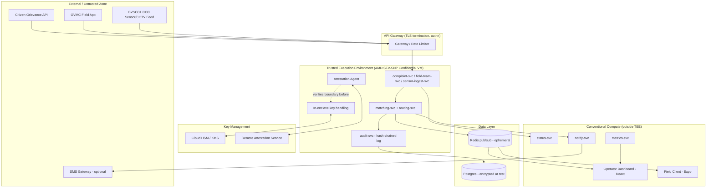
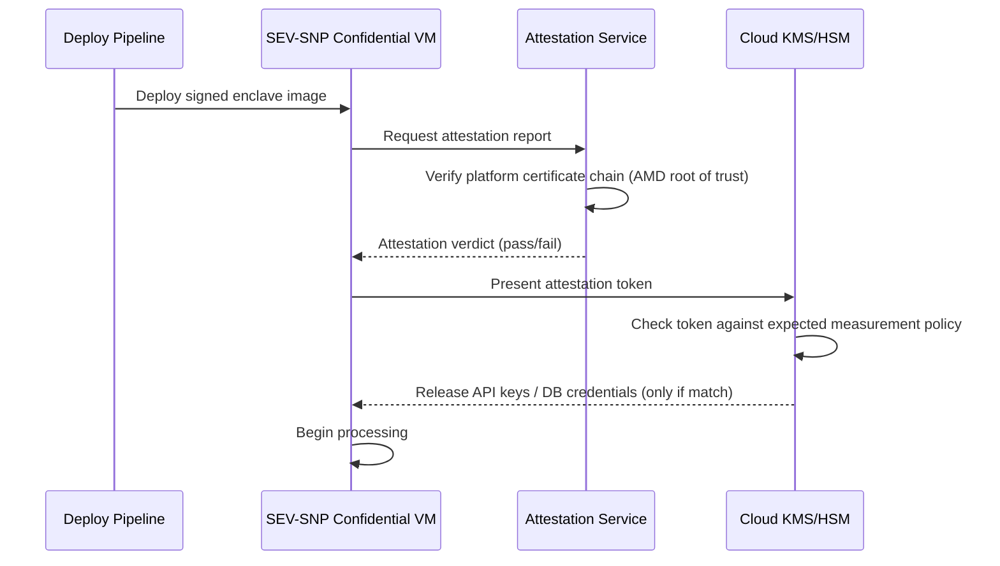

# Backend Architecture Design: VizagOps Unify

**Based on:** Technical Architecture Plan (TAP) v1.0
**Classification:** Government Pilot — Handle as Sensitive

---

## 1. Executive Summary

This document details the backend architecture for VizagOps Unify, a system that correlates GVMC citizen complaints, field-team feeds, and GVSCCL COC sensor/CCTV event metadata to auto-suggest and dispatch the nearest field team. 

Due to the sensitivity of citizen PII and COC sensor feeds, this architecture mandates a **Trusted Execution Environment (TEE)** using **AMD SEV-SNP** (confidential VMs). The system is designed to securely process data within this enclave while strictly controlling key management and remote attestation, ensuring that raw sensitive data never leaves the enclave unencrypted.

---

## 2. High-Level Architecture Topology

The system is segmented into an External/Untrusted Zone, an API Gateway, a Trusted Execution Environment (TEE), a Key Management Service (KMS), and a set of Conventional Compute services.

---

## 3. Microservices Specification

The backend is composed of several microservices, cleanly separated by their trust boundary requirements.

### 3.1 Services Inside the TEE Boundary
These services process raw, unencrypted sensitive data and credentials.

*   **`complaint-svc`**: Ingests citizen grievances. Validates and normalizes Citizen IDs (even if anonymized) before any persistence.
*   **`field-team-svc`**: Ingests field team status and location feeds. Treats location data as sensitive officer safety data.
*   **`sensor-ingest-svc`**: Ingests GVSCCL COC sensor/CCTV events. Extremely high sensitivity. Holds feed credentials and raw streams exclusively in-memory within the enclave.
*   **`matching-svc`**: The core correlation engine mapping complaints to sensor data. This is the primary TEE candidate as both sensitive streams co-reside here.
*   **`routing-svc`**: Computes the nearest available team and ETA. Co-located with `matching-svc` to avoid plaintext network hops.
*   **`audit-svc`**: Provides a tamper-evident audit trail. Entries are hashed and chained inside the enclave before being written to the external database.

### 3.2 Services Outside the TEE Boundary
These services handle non-sensitive routing, encrypted data, or purely aggregate metrics.

*   **`status-svc`**: Exposes basic status updates (strings only) to citizens without interacting with the enclave core.
*   **`notify-svc`**: Handles one-click assignment notifications. Receives payloads signed by the enclave before dispatching them.
*   **`metrics-svc`**: Processes and exposes aggregated instrumentation (latency, match-rates) without exposing PII.
*   **`sms-gateway-adapter`**: Adapts notifications for external SMS delivery using minimal, non-sensitive payloads (e.g., assignment IDs, omitting complaint text).

---

## 4. Security & TEE Integration Architecture

### 4.1 Remote Attestation and Key Management
The system utilizes a strict remote attestation flow before any sensitive operations can commence. 

1.  **Deployment**: A signed enclave image is deployed to an AMD SEV-SNP Confidential VM.
2.  **Attestation Request**: The VM requests an attestation report (including its measurement hash and platform certificate chain).
3.  **Verification**: The Attestation Service validates the AMD root of trust and the image measurement.
4.  **Key Release**: Only upon successful attestation does the Cloud KMS release the necessary API keys and database credentials to the enclave's in-memory key handler.

### 4.2 Data Flow & Privacy Enforcement
*   **In-Transit**: All communications use TLS 1.3. The hop from the API Gateway into the TEE relies on **Attested TLS**.
*   **At-Rest**: Postgres uses Transparent Data Encryption (TDE). Redis is strictly ephemeral (Pub/Sub) with no long-lived sensitive state.
*   **In-Memory**: The SEV-SNP platform provides full transparent memory encryption. 
*   **Audit Logging**: The `audit-svc` creates a hash chain of state transitions. Modifying historical logs externally will break the chain and alert administrators.

---

## 5. Implementation Tracks & Pilot Constraints

As detailed in the TAP, there is a divergence between the original PRD scope and the strict TEE requirements. The architecture supports two operational tracks:

*   **Track A (Deferred TEE)**: Pilot launches with conventional security (mTLS, per-source API keys, encryption at rest). The TEE structure defined above is maintained logically but runs on standard VMs until Phase 2.
*   **Track B (Full TEE Pilot)**: Pilot launches with the AMD SEV-SNP infrastructure active. This requires a revised budget and extended timeline as defined in the TAP to properly configure the Attestation Service and KMS key-release policies.

*This document outlines the target state for Track B and Phase 2 of Track A. No application code has been generated; this document serves as the structural contract for backend engineering.*
